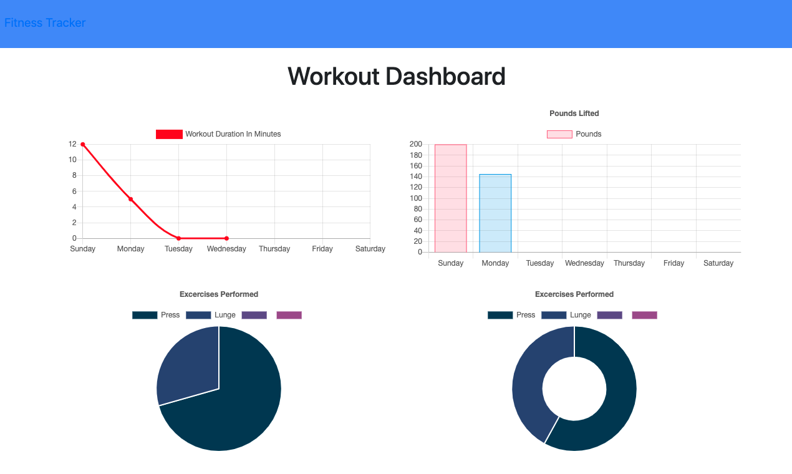

# Workout-Tracker

## User Story

* As a user, I want to be able to view create and track daily workouts. I want to be able to log multiple exercises in a workout on a given day. I should also be able to track the name, type, weight, sets, reps, and duration of exercise. If the exercise is a cardio exercise, I should be able to track my distance traveled.

## Business Context

A consumer will reach their fitness goals quicker when they track their workout progress.

## Description

User is able to track their workouts and add to them depending on the type completed. They can record Cardio workouts or resistance workouts. Each excercise is grouped by type and the day it was completed. The user can also view their completed workouts through charts and they will be presented with total amounts of each measument collected over a weeks time.

